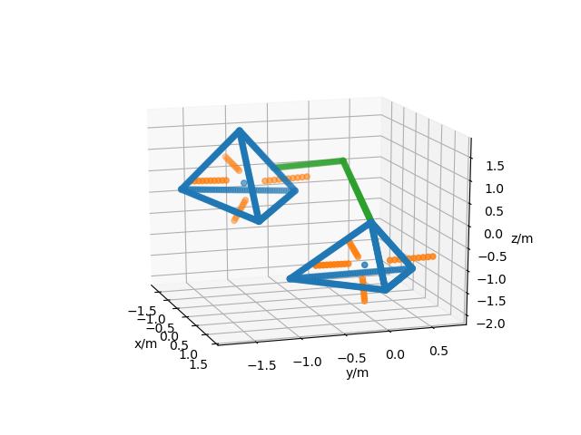

# Collision Tetrahedra Library (libtetrahedra)

## Introduction
libtetrahedra is a header only library, that allows users to apply fast collision checks with tetrahedron models. The values below shows the speed of collision check
```bash
construct_tetrahedron 0.001645 ms 
point_poly_collision 0.001355 ms
```
| **Shortest Path from point to any tetrahedron** |
| -- |
| [](shortest.png) |


- This library references the nearest point to face method in `Distance Between Point and Triangle in 3D` by `David Eberly` (https://www.geometrictools.com/Documentation/DistancePoint3Triangle3.pdf)

---

## Setup
```bash
git clone git@github.com:matthewoots/libtetrahedra.git --recurse-submodules
cd libtetrahedra
mkdir build && cd build
cmake .. 
make
```

---
## Run 

Run `./simple` in the `build` folder

```bash
# Using matplot via a 3rd party package to plot the results
# 3d edges are visualized by linspace the points and adding it into a scatter plot
plt::show();
```

---

## Include in other projects
To link this header only library, just `include the header file`, hence just add following in the desired `CMakeLists.txt`
```
include_directories( ...
    libtetrahedra/include)
```
